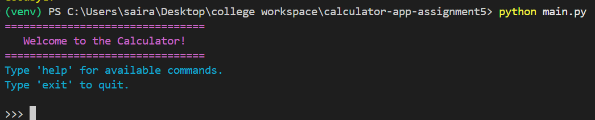

<div align="center">
  <h1>🧮 Advanced Calculator Application</h1>
  <p><i>A beautifully styled, fully-featured command-line calculator built with Python.</i></p>

  
  
  
</div>

<br />

## 📸 Showcase & REPL Demo

Experience our intuitive, color-coded REPL interface in action. The application features robust syntax highlighting for commands, success messages, operational status, and errors natively leveraging `colorama` for a seamless user experience!

<p align="center">
  
  
</p>

<p align="center">
  
  
</p>

<p align="center">
  
</p>

---

## 📖 Project Description

This project is a sophisticated command-line calculator application built with Python, showcasing the integration of advanced software design patterns to create a modular, extensible, and maintainable system. It moves beyond basic arithmetic to offer a rich feature set including persistent history, undo/redo functionality, and comprehensive logging, all configurable via environment variables.

The core of the application is an interactive Read-Eval-Print Loop (REPL), providing a seamless user experience for performing calculations. The design heavily emphasizes principles of clean architecture, separating concerns into distinct modules for operations, data persistence, and user interaction.

### Key Features

- **Interactive Command-Line Interface**: A user-friendly REPL for continuous calculations.
- **Extensive Arithmetic Operations**: Supports a wide range of calculations including `add`, `subtract`, `multiply`, `divide`, `power`, `root`, `modulus`, `integer divide`, `percentage`, and `absolute difference`.
- **Software Design Patterns**:
  - **Observer**: Notifies observers of state changes, used for logging and auto-saving.
  - **Memento**: Captures and restores the calculator's state for undo/redo.
  - **Strategy**: Encapsulates algorithms in interchangeable strategies, used for arithmetic operations.
  - **Factory**: Creates calculation objects, decoupling instantiation logic.
  - **Facade**: Provides a simplified, unified interface to the complex calculator subsystem.
- **Persistent History**: Manages calculation history using `pandas`, with options to save to and load from CSV files.
- **Flexible Configuration**: Application settings are managed through a `.env` file, allowing for easy customization.
- **Robust Error Handling**: Implements custom exceptions and thorough input validation.
- **Comprehensive Logging**: Logs detailed information about operations and errors to a file.

## Installation Instructions

Follow these steps to set up the development environment and run the application.

### 1. Clone the Repository

First, clone the project repository from GitHub to your local machine:

```bash
git clone https://github.com/your-username/your-repository-name.git
cd your-repository-name
```

### 2. Create a Virtual Environment

It is highly recommended to use a virtual environment to manage project dependencies and avoid conflicts with other Python projects.

- **On macOS and Linux**:
  ```bash
  python3 -m venv venv
  source venv/bin/activate
  ```

- **On Windows**:
  ```bash
  python -m venv venv
  venv\Scripts\activate
  ```

### 3. Install Dependencies

With the virtual environment activated, install the required packages from `requirements.txt`:

```bash
pip install -r requirements.txt
```

## Configuration Setup

The application's behavior can be customized through a `.env` file.

### 1. Create the `.env` File

Create a file named `.env` in the root directory of the project.

### 2. Configure Environment Variables

Add the following environment variables to the `.env` file and adjust their values as needed:

```env
# Logging Configuration
CALCULATOR_LOG_DIR=logs
CALCULATOR_LOG_FILE=calculator.log
LOG_LEVEL=INFO

# History Management
CALCULATOR_HISTORY_DIR=data
CALCULATOR_MAX_HISTORY_SIZE=1000
CALCULATOR_AUTO_SAVE=true

# Calculation Settings
CALCULATOR_PRECISION=4
CALCULATOR_MAX_INPUT_VALUE=1e12
CALCULATOR_DEFAULT_ENCODING=utf-8
```

- `LOG_LEVEL`: Sets the logging level (e.g., `DEBUG`, `INFO`, `WARNING`, `ERROR`).
- `CALCULATOR_PRECISION`: Defines the number of decimal places for calculation results.
- `CALCULATOR_MAX_INPUT_VALUE`: Sets the upper limit for numerical inputs to prevent overflow errors.

## Usage Guide

To start the application, run `main.py` from the root directory:

```bash
python main.py
```

The application will launch an interactive prompt where you can enter commands.

### Supported Commands

- **Arithmetic Operations**:
  - `add <a> <b>`: Adds two numbers.
  - `subtract <a> <b>`: Subtracts `b` from `a`.
  - `multiply <a> <b>`: Multiplies two numbers.
  - `divide <a> <b>`: Divides `a` by `b`.
  - `power <a> <b>`: Raises `a` to the power of `b`.
  - `root <a> <b>`: Calculates the `b`-th root of `a`.
  - `modulus <a> <b>`: Finds the remainder of `a` divided by `b`.
  - `int_divide <a> <b>`: Performs integer division of `a` by `b`.
  - `percent <a> <b>`: Calculates `a` percent of `b`.
  - `abs_diff <a> <b>`: Computes the absolute difference between `a` and `b`.

- **History Management**:
  - `history`: Displays the full calculation history.
  - `clear`: Clears the current session's history.
  - `save`: Manually saves the history to a CSV file.
  - `load`: Manually loads the history from a CSV file.

- **Application Control**:
  - `undo`: Reverts the last calculation.
  - `redo`: Restores the last undone calculation.
  - `help`: Shows a list of available commands.
  - `exit`: Terminates the application.

### Example Session

```
>>> add 15 7.5
Result: 15 + 7.5 = 22.5000
>>> multiply 3 4
Result: 3 * 4 = 12.0000
>>> undo
Undo successful. The last operation has been reverted.
>>> history
ID | Operation | Operand A | Operand B | Result
---|-----------|-----------|-----------|-------
1  | add       | 15.0      | 7.5       | 22.5
>>> exit
Goodbye!
```

## Testing Instructions

The project includes a comprehensive suite of unit tests to ensure code quality and correctness.

### Running Unit Tests

To run the tests, execute the following command:

```bash
pytest
```

### Checking Test Coverage

To run the tests and generate a coverage report, use the `--cov` flag:

```bash
python -m pytest --cov=app --cov-report=term-missing --cov-fail-under=95
```

- `--cov=app`: Specifies that coverage should be measured for the `app` directory.
- `--cov-report=term-missing`: Displays a report in the terminal, including line numbers of missing coverage.
- `--cov-fail-under=95`: Fails the test run if coverage is below 95%.

## CI/CD Information

This project uses **GitHub Actions** for Continuous Integration and Continuous Deployment (CI/CD). The workflow is defined in `.github/workflows/ci.yml`.

### Workflow Triggers

The CI workflow is automatically triggered on:
- **Push**: Any push to the `main` branch.
- **Pull Request**: Any pull request targeting the `main` branch.

### Workflow Jobs

1.  **Setup**: Initializes the environment by checking out the code and setting up Python.
2.  **Install Dependencies**: Caches and installs the required Python packages.
3.  **Linting**: Runs `pylint` to enforce coding standards and identify potential issues.
4.  **Testing**: Executes the unit test suite with `pytest` and enforces a minimum test coverage threshold.

This automated process ensures that all code merged into the `main` branch is well-tested and adheres to the project's quality standards.
