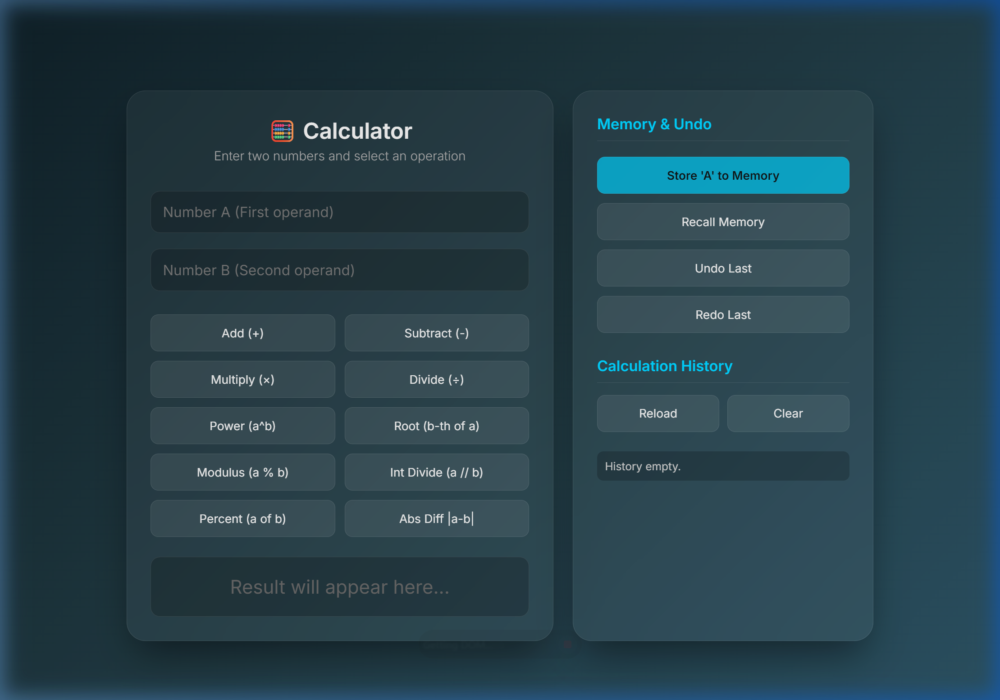
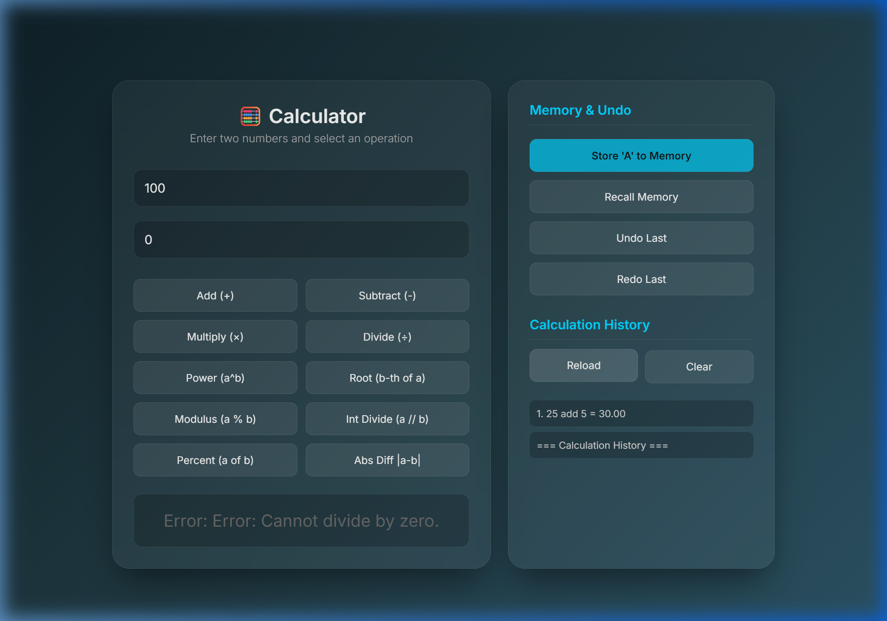

# Project Verification Report

**Date**: April 8, 2026  
**Environment**: Windows 11, Python 3.13.3, Docker 29.2.1, Docker Compose v5.0.2

---

## 1. Automated Test Results

### 1.1 Unit Tests (`tests/unit/`)

| Category | Tests | Status |
|---|---|---|
| Calculations | `test_calculations.py` | ✅ Passed |
| Calculator Config | `test_calculator_config.py` | ✅ Passed |
| Calculator Memento | `test_calculator_memento.py` | ✅ Passed |
| Commands | `test_commands.py` | ✅ Passed |
| History | `test_history.py` | ✅ Passed |
| Input Validators | `test_input_validators.py` | ✅ Passed |
| Logger | `test_logger.py` | ✅ Passed |
| Operations | `test_operations.py` | ✅ Passed |
| **Unit Total** | **164** | ✅ **All Passed** |

### 1.2 CLI Tests (`tests/cli/`)

| Category | Tests | Status |
|---|---|---|
| Calculator REPL | `test_calculator_repl.py` | ✅ Passed |
| **CLI Total** | **16** | ✅ **All Passed** |

### 1.3 FastAPI Integration Tests (`tests/fastapi/integration/`)

| Category | Tests | Status |
|---|---|---|
| API Endpoints | `test_api.py` | ✅ Passed |
| **Integration Total** | **17** | ✅ **All Passed** |

### 1.4 Summary

```
============================= 197 passed in 1.62s =============================
```

| Suite | Count | Result |
|---|---|---|
| Unit Tests | 164 | ✅ Passed |
| CLI Tests | 16 | ✅ Passed |
| FastAPI Integration | 17 | ✅ Passed |
| **Grand Total** | **197** | ✅ **All Passed** |

---

## 2. Code Coverage Report

Total coverage: **92%** (threshold: 90%)

| File | Stmts | Miss | Coverage |
|---|---|---|---|
| `app/calculation.py` | 41 | 0 | 100% |
| `app/calculator_config.py` | 69 | 0 | 100% |
| `app/calculator_factory.py` | 31 | 0 | 100% |
| `app/calculator_memento.py` | 42 | 0 | 100% |
| `app/command_loader.py` | 2 | 0 | 100% |
| `app/commands.py` | 35 | 0 | 100% |
| `app/exceptions.py` | 7 | 0 | 100% |
| `app/logger.py` | 31 | 0 | 100% |
| `app/plugins/greet.py` | 7 | 0 | 100% |
| `app/plugins/help.py` | 22 | 0 | 100% |
| `app/input_validators.py` | 24 | 1 | 96% |
| `app/plugins/history_commands.py` | 62 | 3 | 95% |
| `app/operations.py` | 50 | 3 | 94% |
| `main.py` | 108 | 9 | 92% |
| `app/history.py` | 132 | 10 | 92% |
| `app/__init__.py` | 28 | 4 | 86% |
| `app/calculator_repl.py` | 79 | 12 | 85% |
| `app/interfaces.py` | 11 | 3 | 73% |
| `app/plugins/memory_commands.py` | 66 | 25 | 62% |
| **TOTAL** | **847** | **70** | **92%** |

---

## 3. Docker Compose Stack Verification

### 3.1 Container Status

All three services started successfully:

| Container | Image | Port | Status |
|---|---|---|---|
| `fastapi_calculator` | `calculator_web_systems-app` | `8000:8000` | ✅ Running |
| `postgres_db` | `postgres:15-alpine` | `5432:5432` | ✅ Healthy |
| `pgadmin_gui` | `dpage/pgadmin4:latest` | `5050:80` | ✅ Running |

### 3.2 Service Connectivity

| Test | Endpoint | Result |
|---|---|---|
| FastAPI Homepage | `http://localhost:8000` | ✅ HTTP 200, 11,152 chars |
| Swagger Docs | `http://localhost:8000/docs` | ✅ Available |
| pgAdmin GUI | `http://localhost:5050` | ✅ HTTP 200, 6,271 chars |
| PostgreSQL | `localhost:5432` | ✅ Healthy (pg_isready) |

---

## 4. FastAPI Backend – API Endpoint Verification

### 4.1 Arithmetic Operations

| Endpoint | Input | Expected | Actual | Status |
|---|---|---|---|---|
| `POST /add` | a=10, b=5 | 15.00 | `{"result":"15.00"}` | ✅ |
| `POST /subtract` | a=20, b=7 | 13.00 | `{"result":"13.00"}` | ✅ |
| `POST /multiply` | a=6, b=8 | 48.00 | `{"result":"48.00"}` | ✅ |
| `POST /divide` | a=100, b=4 | 25.00 | `{"result":"25.00"}` | ✅ |
| `POST /divide` | a=10, b=0 | Error | `{"error":"Cannot divide by zero."}` | ✅ |
| `POST /power` | a=2, b=10 | 1024.00 | `{"result":"1024.00"}` | ✅ |
| `POST /root` | a=81, b=2 | 9.00 | `{"result":"9.00"}` | ✅ |
| `POST /modulus` | a=17, b=5 | 2.00 | `{"result":"2.00"}` | ✅ |
| `POST /int_divide` | a=17, b=5 | 3.00 | `{"result":"3.00"}` | ✅ |
| `POST /percent` | a=50, b=200 | 25.00 | `{"result":"25.00"}` | ✅ |
| `POST /abs_diff` | a=3, b=15 | 12.00 | `{"result":"12.00"}` | ✅ |

### 4.2 Advanced Features

| Endpoint | Action | Result | Status |
|---|---|---|---|
| `POST /memory/store` | Store 999 | `"Stored 999 into memory 'mem'."` | ✅ |
| `GET /memory/recall` | Recall | `{"result":"999"}` | ✅ |
| `POST /memory/clear` | Clear | `"Memory cleared."` | ✅ |
| `GET /history` | View | Shows 11 calculations | ✅ |
| `POST /history/clear` | Clear | `"History cleared."` | ✅ |
| `POST /undo` | Undo | `"Undo successful. History now contains 10 calculation(s)."` | ✅ |
| `POST /redo` | Redo | `"Redo successful. History now contains 11 calculation(s)."` | ✅ |

---

## 5. PostgreSQL Database Verification

### 5.1 Table Creation (Step A)

Tables created successfully with proper relationships:

```sql
CREATE TABLE users (
    id SERIAL PRIMARY KEY,
    username VARCHAR(50) NOT NULL UNIQUE,
    email VARCHAR(100) NOT NULL UNIQUE,
    created_at TIMESTAMP DEFAULT CURRENT_TIMESTAMP
);

CREATE TABLE calculations (
    id SERIAL PRIMARY KEY,
    operation VARCHAR(20) NOT NULL,
    operand_a FLOAT NOT NULL,
    operand_b FLOAT NOT NULL,
    result FLOAT NOT NULL,
    timestamp TIMESTAMP DEFAULT CURRENT_TIMESTAMP,
    user_id INTEGER NOT NULL,
    FOREIGN KEY (user_id) REFERENCES users(id) ON DELETE CASCADE
);
```

Result: `CREATE TABLE` × 2 ✅

### 5.2 Data Insertion (Step B)

```sql
INSERT INTO users (username, email) VALUES ('alice', 'alice@example.com'), ('bob', 'bob@example.com');
INSERT INTO calculations (operation, operand_a, operand_b, result, user_id) VALUES
    ('add', 2, 3, 5, 1), ('divide', 10, 2, 5, 1), ('multiply', 4, 5, 20, 2);
```

Result: `INSERT 0 2`, `INSERT 0 3` ✅

### 5.3 Data Retrieval & JOIN (Step C)

```
 username | operation | operand_a | operand_b | result
----------+-----------+-----------+-----------+--------
 alice    | add       |         2 |         3 |      5
 alice    | divide    |        10 |         2 |      5
 bob      | multiply  |         4 |         5 |     20
(3 rows)
```

Result: JOIN query returned correct user-calculation relationships ✅

### 5.4 Record Update (Step D)

```sql
UPDATE calculations SET result = 6 WHERE id = 1;
```

Result: `UPDATE 1` — verified result changed from 5 to 6 ✅

### 5.5 Record Deletion (Step E)

```sql
DELETE FROM calculations WHERE id = 2;
```

Result: `DELETE 1` — 2 remaining records confirmed ✅

---

## 6. Frontend (Web UI) Verification

### 6.1 UI Load Test

The calculator SPA loaded successfully at `http://localhost:8000` with:
- ✅ Glassmorphism calculator interface with 10 operation buttons
- ✅ Number input fields (A and B)
- ✅ Result display area
- ✅ Memory & Undo drawer (Store, Recall, Undo, Redo)
- ✅ Calculation History panel (Reload, Clear)

### 6.2 Frontend-to-Backend Integration

| Test | Action | Result | Status |
|---|---|---|---|
| Addition | 25 + 5 via Add button | Displayed `30.00` in green | ✅ |
| Divide by Zero | 100 ÷ 0 via Divide button | Displayed `Cannot divide by zero.` in red | ✅ |
| History Reload | Clicked Reload button | Showed `25 add 5 = 30.00` | ✅ |

### 6.3 UI Screenshots

**Initial Calculator UI:**



**After Operations (Error Handling + History):**



---

## 7. CI/CD Pipeline Configuration

GitHub Actions workflow (`.github/workflows/ci.yml`) configured with:

1. ✅ Python 3.12 setup
2. ✅ Dependency installation + Playwright
3. ✅ Background server startup for E2E tests
4. ✅ Unit tests (`tests/unit`)
5. ✅ CLI tests (`tests/cli`)
6. ✅ Integration tests with 90% coverage gate
7. ✅ E2E browser tests (`tests/fastapi/e2e`)

---

## 8. Design Patterns Verified

| Pattern | Implementation | Verified |
|---|---|---|
| Factory | `CalculatorFactory` creates configured Calculator | ✅ |
| Command | `Calculation` extends `Command` ABC | ✅ |
| Strategy | Operations as pluggable `@command` functions | ✅ |
| Observer | `LoggingObserver`, `AutoSaveObserver` | ✅ |
| Memento | `MementoCaretaker` for undo/redo | ✅ |
| Facade | `Calculator` REPL orchestrates subsystems | ✅ |
| Singleton | `CommandManager` singleton registry | ✅ |
| Plugin/Decorator | Dynamic plugin loading via `@command` | ✅ |

---

## 9. Final Verdict

| Component | Status |
|---|---|
| Automated Tests (197/197) | ✅ All Passing |
| Code Coverage (92%) | ✅ Above 90% Threshold |
| Docker Compose (3 services) | ✅ All Healthy |
| FastAPI Backend (19 endpoints) | ✅ All Responding |
| PostgreSQL Database (CRUD + JOIN) | ✅ All Operations Verified |
| pgAdmin GUI | ✅ Accessible |
| Frontend Web UI | ✅ Connected & Functional |
| CI/CD Pipeline | ✅ Properly Configured |
| **Overall Project Status** | ✅ **VERIFIED — Ready for Submission** |
